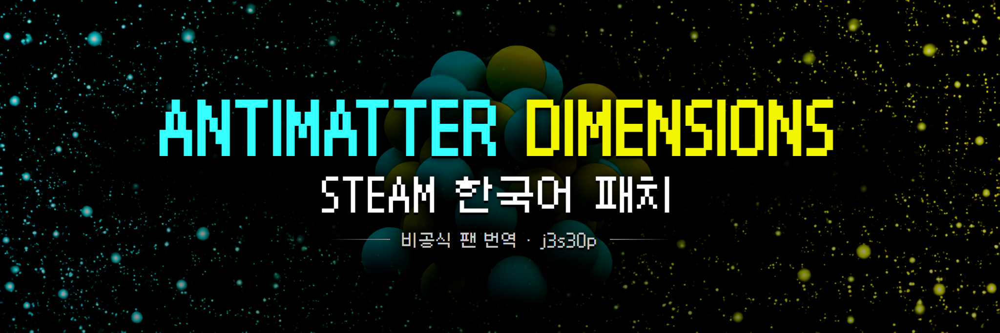

  

<h1 align="center">
  <a href="https://github.com/j3s30p/antimatter_ko/releases/download/v1.0.0/AntimatterDimensions_KoreanPatch_1.0.0.zip">⬇️ 한국어 패치 다운로드</a>
</h1>

  <strong>v1.0.0 · Steam 11.5 전용</strong> 
  설치용 ZIP 파일 하나만 받으면 됩니다.

> [!IMPORTANT]
> GitHub의 초록색 **Code** 버튼에서 받는 **Source code**는 설치 파일이 아닙니다.
> 반드시 위의 **한국어 패치 다운로드** 링크를 이용해 주세요.

## 설치 방법

1. 게임과 백그라운드에 남은 게임 프로세스를 완전히 종료합니다.
2. Steam 라이브러리에서 **Antimatter Dimensions 우클릭 → 관리 → 로컬 파일 보기**를 누릅니다.
3. 받은 ZIP의 압축을 풀고, 안에 있는 `resources` 폴더만 게임 폴더에 끌어다 놓습니다.
4. `app.asar` 덮어쓰기를 선택한 뒤 게임을 실행합니다.

> `resources` 폴더 전체 대신, 압축본의 `resources\app.asar` 파일 하나만 게임 폴더의 `resources` 안에 직접 붙여넣어도 됩니다. 나머지 파일은 안내 및 라이선스 문서이므로 게임 폴더에 복사하지 않아도 됩니다.

---

## 원상복구

Steam 라이브러리에서 게임을 우클릭한 뒤 **속성 → 설치된 파일 → 게임 파일 무결성 검사**를 실행하면 원본 상태로 되돌릴 수 있습니다.

저장 데이터는 게임 설치 폴더와 별도로 보관되므로, 패치를 설치하거나 원상복구해도 기존 진행도는 유지됩니다.

---

## 패치 정보

| 항목 | 내용 |
| --- | --- |
| 최신 공개 버전 | `v1.0.0` |
| 대상 게임 | Steam판 `11.5` |
| 지원 UI | 클래식 UI · 모던 UI |
| 적용 파일 | `resources/app.asar` |
| 한국어 글꼴 | Galmuri9 Regular |
| 저장 데이터 | 기존 저장과 호환 |

이 패치는 메뉴와 UI, 도움말, NEWS, 도전과제, 설정, 진행 단계별 설명과 메시지 등 번역 대상인 모든 플레이어 노출 문구를 한국어로 제공합니다.

### 추가 편의 기능: 단축키 설정

게임에서 `?`를 누르거나 설정 화면의 단축키 안내를 클릭하면 단축키 설정을 열 수 있습니다.

- 구매·진행 단축키를 원하는 키 조합으로 변경하거나 해제할 수 있습니다. `모두 최대로`를 `M` 대신 `Space`에 지정하는 것도 가능합니다.
- 이미 사용 중인 키를 지정하면 두 기능의 단축키가 서로 바뀝니다. 필요하면 기본 설정으로 되돌릴 수 있습니다.
- 아직 해금하지 않은 기능은 이름이 글리치로 가려지지만, 배정된 키는 미리 확인할 수 있습니다.

<strong>번역 원칙과 영어로 유지한 항목</strong>

### 번역 원칙

- 원문이 풀네임이면 한국어 풀네임으로 번역합니다.
- 원문이 약어이면 `AM`, `IP`, `EC`, `RM`처럼 원문의 약어와 대소문자를 유지합니다.
- 같은 게임 용어와 고유명사는 모든 진행 단계에서 일관되게 사용합니다.
- 명령어, 저장 형식, 내부 식별자처럼 기능에 영향을 주는 문자열은 변경하지 않습니다.

### 영어로 유지한 항목

- 오토메이터 명령어와 문법 토큰
- 내부 ID 및 저장 데이터 키
- 기호 자체가 의미를 가지는 특수 표기법
- 글리치, Zalgo 문자 등 의도적으로 깨져 보이는 연출

<strong>개발 소스와 진행 기록</strong>

설치용 파일과 개발 소스는 서로 분리해 관리합니다. 번역 소스, 빌드 설정과 작업 기록은 [`source` 브랜치](https://github.com/j3s30p/antimatter_ko/tree/source)에서 확인할 수 있습니다.

- [번역 진행 기록](https://github.com/j3s30p/antimatter_ko/blob/source/docs/TRANSLATION_PROGRESS.md)
- [번역 범위](https://github.com/j3s30p/antimatter_ko/blob/source/docs/TRANSLATION_SCOPE.md)
- [용어집](https://github.com/j3s30p/antimatter_ko/blob/source/docs/GLOSSARY.md)

## 라이선스 및 출처

- 원작: Hevipelle (Ivark) 및 Antimatter Dimensions 기여자
- 한국어 패치 제작 및 관리: j3s30p
- 한국어 번역 참고: SameMa의 Endgame 한국어판, SeonjiSoup621의 ADKorean
- 한국어 글꼴: Galmuri9 Regular — SIL Open Font License 1.1

자세한 저작권과 출처 정보는 [ATTRIBUTION.md](ATTRIBUTION.md), 글꼴 라이선스 전문은 [Galmuri OFL 1.1](https://github.com/j3s30p/antimatter_ko/blob/korean-localization/licenses/Galmuri-OFL-1.1.txt)에서 확인할 수 있습니다.

이 패치는 비공식 팬 번역이며, 원작 제작진과 공식적으로 제휴하거나 승인을 받은 배포판이 아닙니다.
